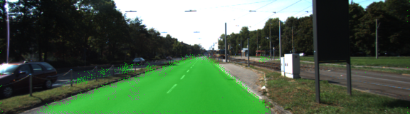
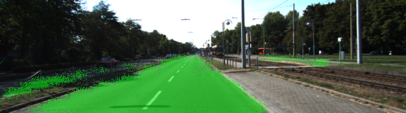
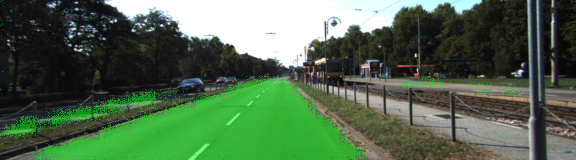
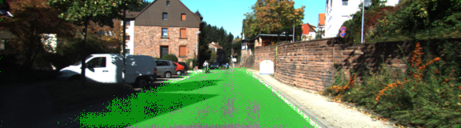
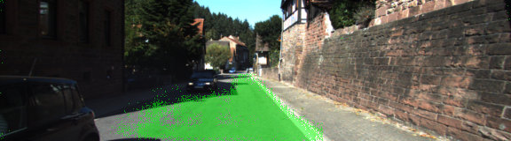
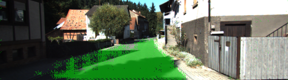

# Semantic Segmentation

## Loading the Pretrained VGG16 Model

The pretrained model is loaded by [load_vgg()](main.py#L20-L43). It returns a tuple of the relevant layers which will be accessed later on.

## Feature Learning

The previously loaded layers are combined in a way suitable for semantic segmentation in [layers()](main.py#L46-L89). 

## Neural Network Optimization

Optimization of the trained network happens in [optimize()](main.py#L93-L120). This allows the inference stage to run faster, achieving good enough performance even on modest hardware.

## Training the Neural Network

The network is trained in [train_nn()](main.py#L124-L153). For each epoch its number is printed out and for each batch the loss is printed.

* The loss slowly decreases during training.
* I set the number of epochs to 25, loss didn't seem to decrease much further at that point.
* A batch size of 4 seemed to work fine, keeping memory usage low while still performing decently.
* Most of the road-pixels in the current lane are labeled as such, while everything else like trees, sky, other cars and asphalt outside the current lane are fairly clear. 

## Sample images

As can be seen sections of well-lit road are handled well, while really dark shadows are more challenging to be properly classified as road.

## Original README
See [README-original.md](README-original.md)
